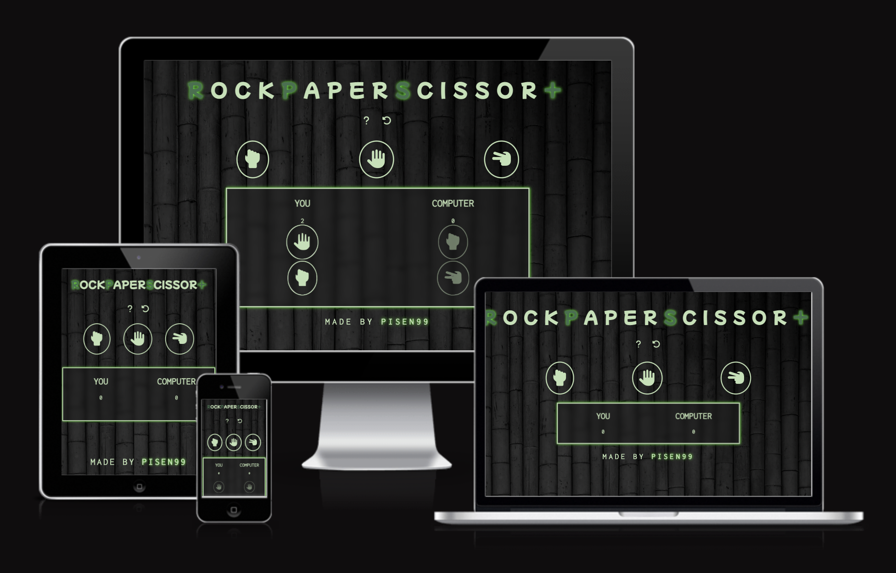
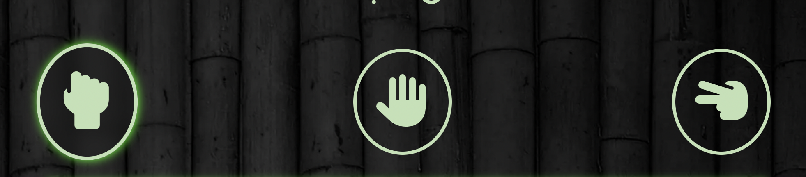

# Rock, Paper & Scissor +   [Play the game here!](https://pisen99.github.io/project-2.resub/)
RockPaperScissor+ is a simple game for all the ages. It's most common to play as kids but even grown ups play this game. The game is played when you want to settle something between two people. It's easy to compare the idea behind the game to "coin-flipping" or "rolling a dice", winner gets to decide what to do after that. First to five wins the dispute between the two people.

## Index - Table of contents
* [Description](#description)
* [User Experience](#user-experience)
* [Features](#excisting-features)
* [Design](#design)
* [Technologies used](#technological-used)
* [Testing](#test-cases)
* [Validator tests](#validator-test)
* [Deployment](#deployment)
* [Credits](#credits)

## Description

### How to play:
* Rock beats scissor.
* Scissor beats paper.
* Papper beats rock.

### Three results:
* Win, awards 1 point.
* Lose, awards 0 points.
* Draw, awards 0 points to both players.

### Game ends when:
* Whoever reaches five points first will win this game.

## User Experience

### A.First Time Visitor Goals
  a. As a first time visitor, I want to quick and easily understand the game's purpose.
  b. As a first time visitor, I want to navigate fast and easily on the website to find information about the game.
  
### B.Returning Visitor Goals
  a. As a returning visitor, I want to easily navigate through the rules to find out how this game works.
  b. As a returning visitor, I want to find the buttons easily and take me to the right place.

## Excisting Features

## f1 Header and buttons
    The header and buttons has an easy navigation to it on different devices.
    It will be easy to find the buttons right under the logo with a simple yet informative icon.
    The icons will make a smal but noticible change when user hovers over them.
    Once you press the book icon it will appear with the rules for the game and an easy navigation to go back to the game.

## f2 Background image
    I wanted to have a background to give the website a more calm approach to it making the user want to stay for longer to play.

## f3 Modules
    Once the user is taken to the "rules" or "game over" button I put a blur effect around the modules. This to limit the accesability on the website. User does not need to keep playing the game once the game is over for example. To access the websites full potential user must leave the modules first.

## f4 Footer
    I made this for the user to see who made the game. In the footer the name "Pisen99" is highlighted and linked to all the github repositories created by the name. The inspiration for this idea is from [iama3191](https://iama3191.github.io/rock-paper-scissors-lizard-spock/).

## Design

### Flexbox
* Using flexbox rather than just margins or borders. This will keep the code more clean and responds easier to responsive design.

### Color scheme
* To tie the game on the webpage togheter I used two main colors, "Tea Green" for text, icons & borders. I used "Dark Spring Green" to make the logo pop a little bit. The rest of the colors were used for text-shadows to create a highlight effect when user hovers over certain buttons.

### Background-image
* I wanted my webpage to have a background that goes well with the color of the icons as well as the text color. The dark background makes the other colors stand out a little more as well.

### Buttons with Icon
* Keeping it simple and clean so user can focus mainly on the game. If user is unsure they will easily find the icons easy to accsess and understandeble any time during their game. A simple highlight of the buttons will appear when user hovers over them.

### Game history
* Created game history with a lower opacity so user can see what selection was actually played from "you" and "computer" without it taking over the whole game, easy for the eye. The winner of that round will show easily as the score will increase by one point. If it's a draw then both icons will be at a lower capacity, symbolising that no one got a point from that round.

### Typhography
* For heading and texts "Inconsolata, monospace" is used. It has a sipmle look to it that will work with the rest of the website. To make the logo stand out a little bit I used "Mochiy Pop One, sans-serif", it's bold and easy to read.

## Technological used
  
### Language used,
      HTML5 
      CSS3
      JavaScript
      
### Programs and Libraries used,
      Google fonts used to import "Inconsolata, monospace" & "Mochiy Pop One, sans-serif".
      Font Awesome used to get icons for my rules, restart game, combat options buttons.
      Github/Gitpod used to save code, commits and pushes.

## Test cases

## Validator test
      
### HTML:
First time I tried it, I expected everything to work but it seemed to be giving me a warning about comments made. I decided to ignore it, since it's important I can understand my code properly (It's not effecting the code these warnings)

Before and after I changed the spelling error and made section in to divs instead, here's the result:

### CSS:
First time try, it's a pass.

## Lighthouse:
First time try & it's a pass. I choosed to improve it by moving script tag from head to the end of body, improving the "score" by a little bit.

## JavaScript:
First time try, it's a pass

## Deployment

* The site was created in GitHub pages, these are the steps to deploy:
  * Log in to GitHub and go to repositories.
  * In GitHub on the right side of the repository click on settings.
  * In settings on the left side menu select "Pages".
  * Under branch, select "Main" and select folder "(Root)"
  * Press save and the page will automatically refresh and your site will be att the top. It might take a few minutes, be patient.

## Credits

- Icons comes from [here](https://fontawesome.com/)

- Font-type comes from [here](https://fonts.google.com/knowledge)

- Favicon designed from [here](https://favicon.io/favicon-generator/)

### Validator tests
- HTML is tested [here](https://validator.w3.org/)
- CSS is tested [here](https://jigsaw.w3.org/css-validator/)
- JavaScript is tested [here](https://jshint.com/)
- LightHouse is tested [here](https://pagespeed.web.dev/)

- Used as an inspiration for structure and javascript when making the rules popup:
[Iama3191](https://iama3191.github.io/rock-paper-scissors-lizard-spock/)
      
- Used to create an open and close function in javaScript: [stackowerflow](https://stackoverflow.com/questions/21070101/show-hide-div-using-javascript)
      
- Used to create basic structure and inspiration in JavaScript: [WebDevSimplify](https://www.youtube.com/watch?v=1yS-JV4fWqY)

- Used to arrange the [colors](https://coolors.co/6033a3-3c1563-800080-f5f5f5-4054ae) for readme.

- Images taken from:
[background-img](https://wallpaper.dog/search?q=bamboo)